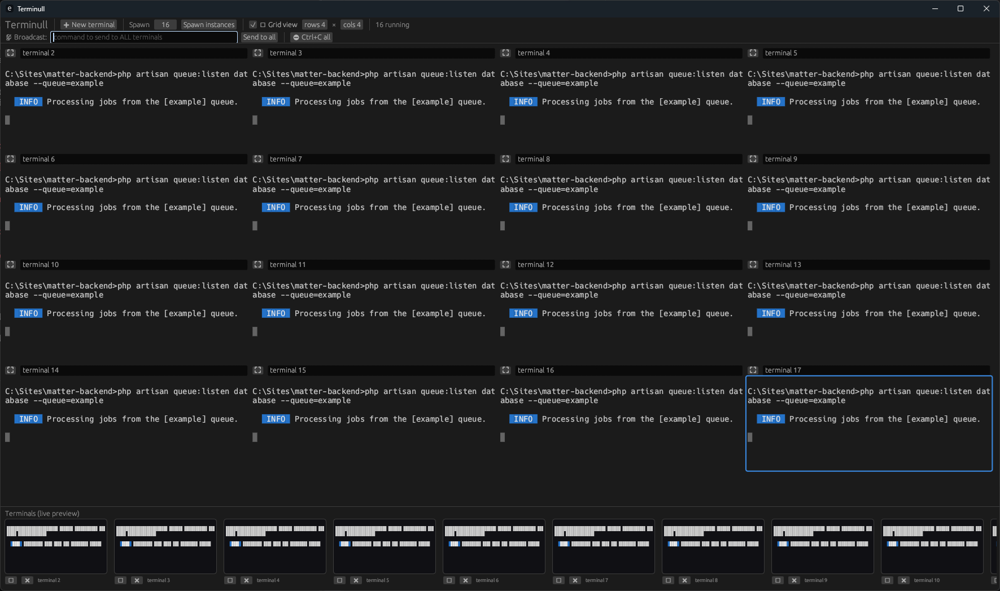

# Terminull

Run a whole fleet of terminals from one window.



- Spawn as many terminals as your machine can handle
- Display them in a grid (up to 8×8)
- Send a command (or Ctrl+C) to all of them at once
- Or click in and control them one by one

## Run it

```
cargo run --release
```

On Windows, use the MSVC toolchain (`rustup default stable-x86_64-pc-windows-msvc`).

Built with [egui](https://github.com/emilk/egui),
[portable-pty](https://crates.io/crates/portable-pty) and
[vte](https://crates.io/crates/vte). MIT licensed.
